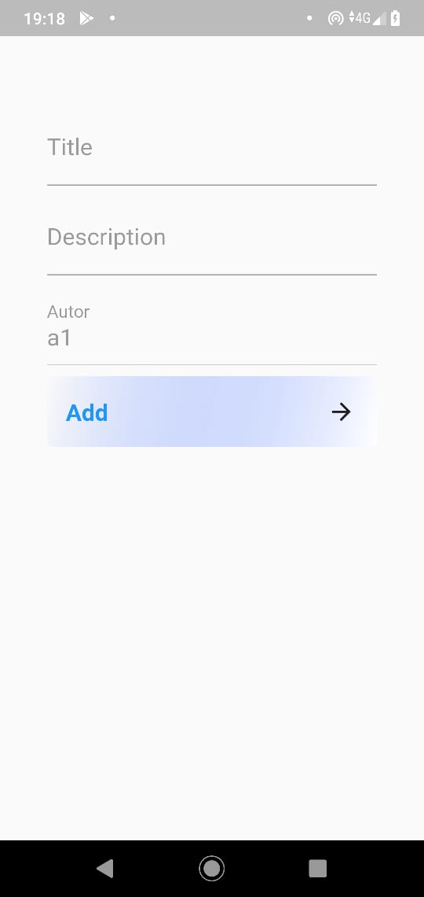
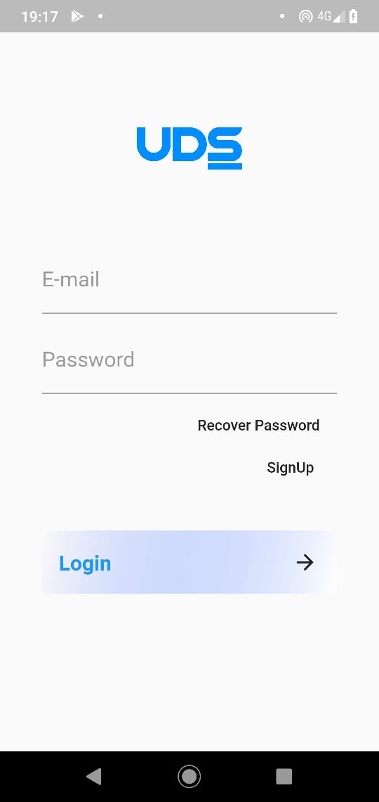
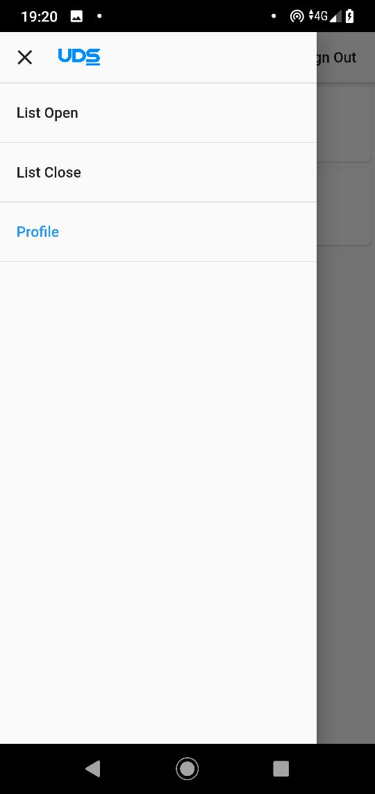
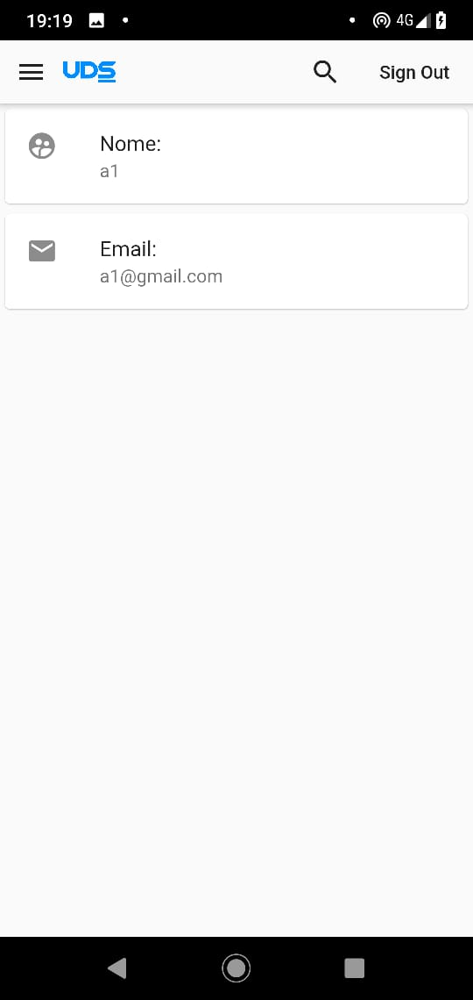
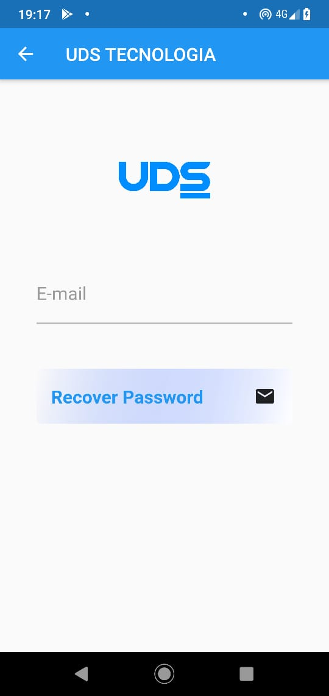
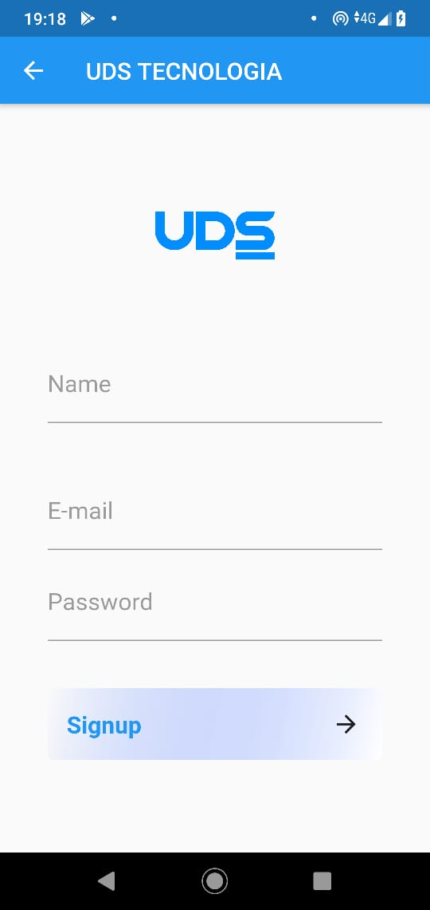
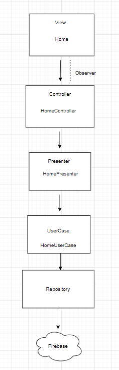

## UDS App

## Tecnologias utilizadas: 

-- Flutter  
-- Dart    , 
-- Clean Architecture , 
-- Firebase , 
-- FireStore ,  

## Requisitos Mínimos

Foi implementado os requisitos obrigatórios requisitados: 
  
* Cadastro de usuários: cadastrar usuário, recuperar senha, validação dos formulários de login
  
* Pautas: listar pautas abertas e fechadas e cadastro de pautas.
  
* Perfil: exibir perfil de acesso.
  

  
  
  
  
  
  
  

Segue abaixo, o diagrama que explica como foi implementado a arquitetura baseado nos conceitos de Clean Architecture.
  

  

